# Introduccion a Github 

## Tabla de Contenidos

1. [Crear un nuevo repositorio](#crear-un-nuevo-repositorio)
2. [Subir la carpeta src de java al repositorio](#subir-la-carpeta-src-de-java-al-repositorio)
3. [Crear una rama en el repositorio](#crear-una-rama-en-el-repositorio)
4. [Descargar el contenido de la rama al repositorio local](#descargar-el-contenido-de-la-rama-al-repositorio-local)
5. [Crea una clase nueva y realiza la actualización de la rama en el repositorio](#crea-una-clase-nueva-y-realiza-la-actualización-de-la-rama-en-el-repositorio)
6. [Guardar modificaciones realizadas en Java y subirlas al repositorio](#guardar-modificaciones-realizadas-en-java-y-subirlas-al-repositorio)
7. [Realizar comprobacion de los cambios](Realizar-comprobacion-de-los-cambios)
8. [Fusionar rama con el main del repositorio](#fusionar-rama-con-el-main-del-repositorio)

## Crear un nuevo repositorio

Hacemos clic en ***Repositories*** y esto nos llevará a una interfaz en la que tendremos que indicar el nombre del repositorio.
Podemos indicar si será *private* (nadie podrá ver dicha publicación) o *public* (quedará a la vista en GitHub) e incluimos un ***Readme*** para incluir información sobre el proyecto que se ha realizado.

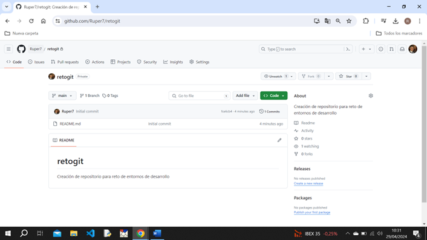

## Subir la carpeta src de java al repositorio

Accedemos al repositorio y desplegamos la pestaña ***Add file***, hacemos clic en ***Upload file***.

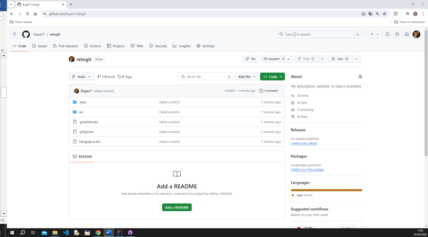

Esto nos llevará a una nueva interfaz para subir la carpeta.

Tenemos dos maneras de incluir la carpeta src de java:
  - ***Choose your files***: podemos acceder a la ruta donde está la carpeta que queremos subir.
  - Arrastramos la carpeta al recuadro.

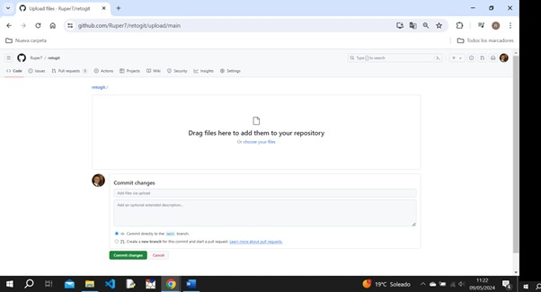

## Crear una rama en el repositorio

Dentro del repositorio hacemos clic en ***main***, escribimos el nombre de la nueva ramma y de forma automática nos indica si queremos crearla mediante el mensaje ***Branch desarrolloPresona from main***. Hacemos clic y ya tendríamos creada la nueva rama.

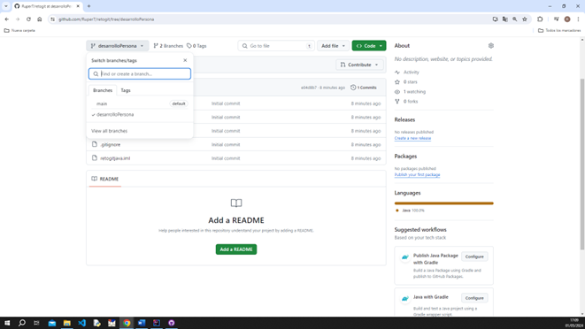

## Descargar el contenido de la rama al repositorio local

Debemos instalar ***GitHub Desktop***. Url para la instalación (https://desktop.github.com/?ref_cta=download+desktop&ref_loc=installing+github+desktop&ref_page=docs).

Una vez instalado, abrimos el programa y seleccionamos ***File*** y clic en ***Clone***. De esta manera hemos conseguido clonar nuestra rama *main* a nuestro repositorio local.

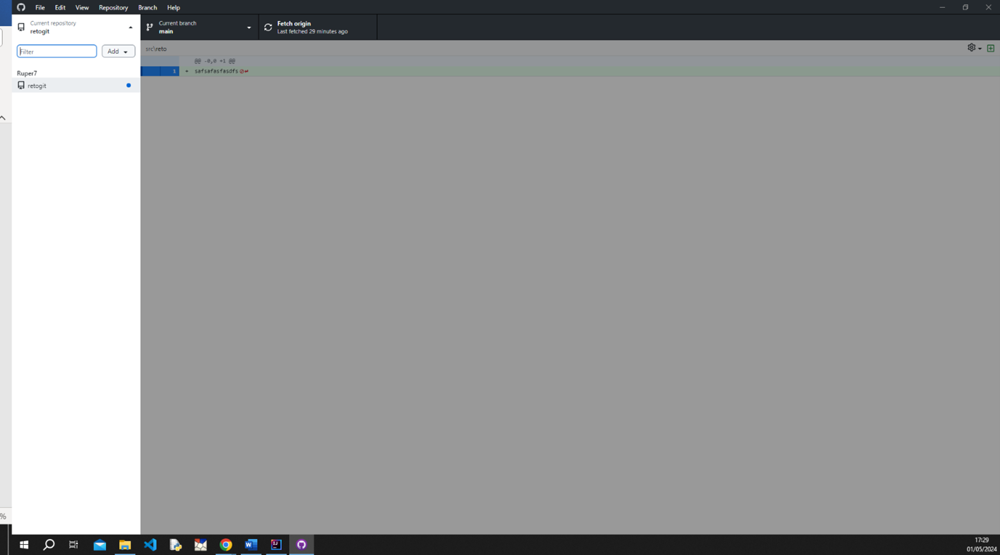

## Crea una clase nueva y realiza la actualización de la rama en el repositorio

Creamos una nueva clase en la carpeta src de java.
De forma automática, GitHub Desktop detectará el cambio que se ha realizado.
Debemos dejar un comentario con las modifiaciones que hemos realizado, en mi caso he anotado *Nueva clase - Personas*.
Realizamos un ***commit to main*** para que los cambios queden guardados.
Finalmente realizamos un ***Push*** para que quede subido y actualizado en el repositorio.

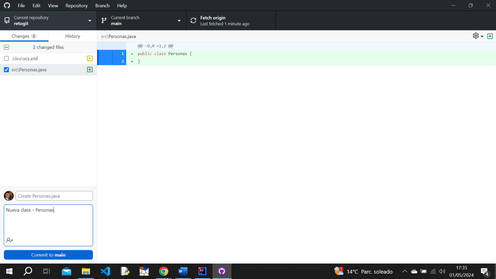

## Guardar modificaciones realizadas en Java y subirlas al repositorio

Escribimos dentro de la clase nueva que habiamos creado en java e inmediatamente GitHub Desktop nos informará de la modificiación que se ha realizado.
Volvemos a dejar comentario, en mi caso *Edición clase - Personas*.
Nuevamente volvemos a realizar un ***commit to main*** para que los cambios queden guardados y finalmente un ***Push*** para subirlo a repositorio.

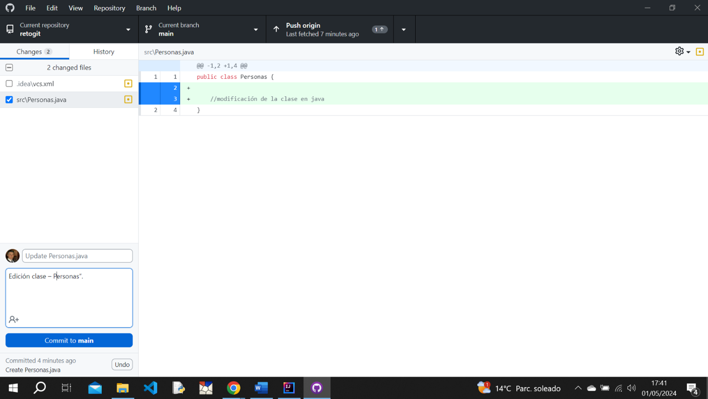

## Realizar comprobacion de los cambios

Para comprobar todos los cambios que hemos realizado y guardado, en GitHub accedemos al repositorio que habiamos creado, hacemos clik en la carpeta ***src*** de java.
Dentro podemos encontrar los ficheros y clases que habiamos creado y modificado.

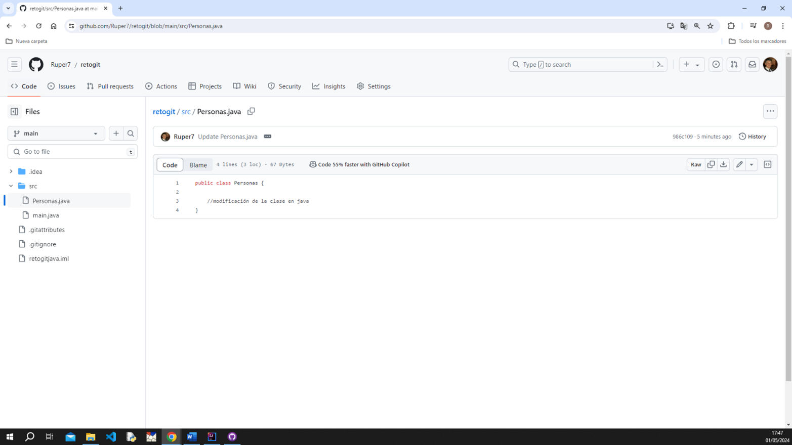

## Fusionar rama con el main del repositorio

Recordamos que habiamos creado una nueva rama llamada ***desarrolloPersona***, accedemos a ella, hacemos clic en el ***+*** e incluimos la imgaen.
Realizamos ***commit*** para guardar cambios.

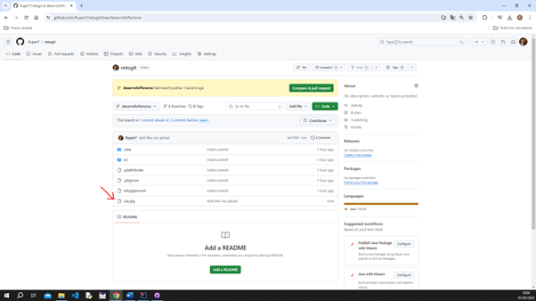

Verificamos que tenemos la fotografía como se indica en la imagen:

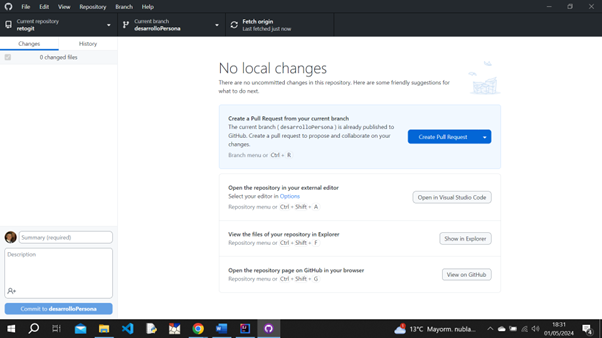

Nuevamente accedemos a GitHub Desktop, seleccionamos la rama *desarrolloPersona* y refrescamos para confirmar si se han realizado cambios. Nos confirmará que si se han realizado.
Podremos elegir entre dos opciones:
  - ***Previwe Pull***: previsualizar los cambios sin guardar los cambios.
  - ***Create Pull request***: guardará los cambios en la carpeta local de nuestro pc.

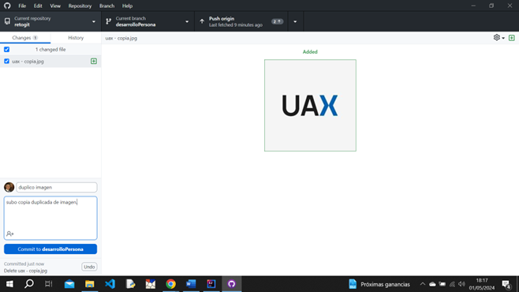

El cambio que he llevado a cabo es duplicar la imagen que hay en nuestra carpeta local del pc. 
Una vez duplicada me aparecerá el simbolo + en verde indicnado que se han realizado cambios.
Antes de hacer un ***commit***, dejamos titulo (en mi caso duplico imagen) y descripción de la modificación realizada (en mi caso subo copia duplicada de imagen).

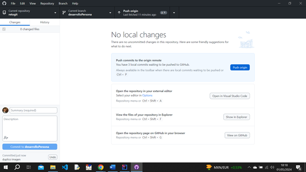

Realizmos ***Pusch origin*** para subir los cambios en la rama que hemos seleccionado que en nuestro caso será *desarrolloPersonal*.

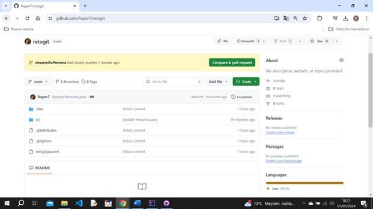

Comprobamos que los cambios se han realizado correctamente en la rama que hemos indicado y no en el main.

***RAMA main***

Podemos comprobar que las imagenes no están subidas en el main.

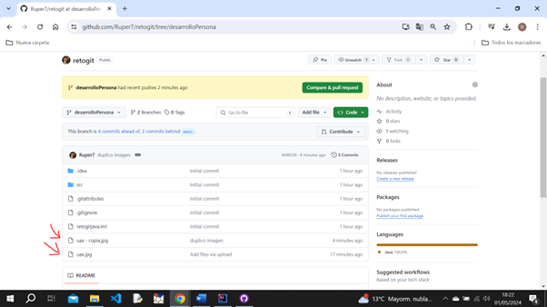

***RAMA desarrolloPersona****

Confirmamos que las dos imagenes están en la rama desarrolloPersona

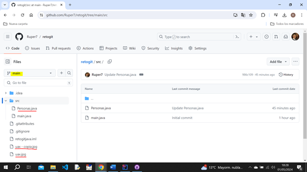

Finalmente vamos a realizar la fusión de las dos carpetas haciendo clic en ***Compare&pull request***.
Esta fusión clonará lo que tiene la rama *desarrolloPersona* a la rama *main*.
La rama *main* obtendrá lo nuevo de la rama *desarrolloPersona* y mantendrá lo que tenía hasta el momento.

Una vez hagamos clic en *Compare&pull request*, nos llevará a una interfaz en la que dejaremos comentario de lo que hemos realizado y nuevamente hacemos clic en ***Create pull request*** para traer los documentos del local al servidor.
Si todo está correcto finalizamos con ***Merge***(fusionar).

***RAMA main***

En la siguiente imagen comprobamos que están las imagenes que anteriormente no existian en esta rama.

